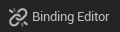
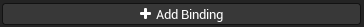
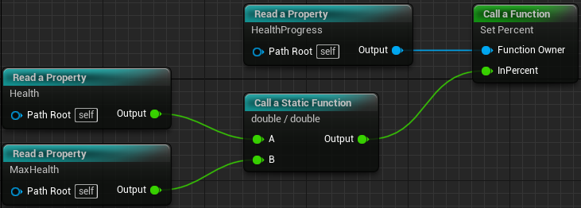
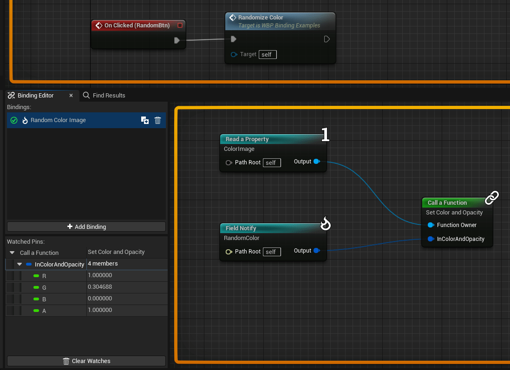
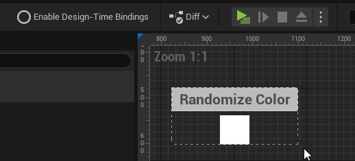
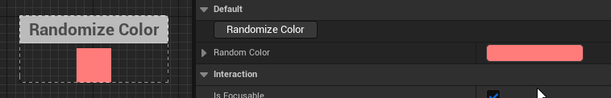

# MDFastBinding
A versatile and performant alternative to property bindings for designer-friendly workflows. Intended for UMG widgets but usable in any blueprint.
The goal was to build a tool that allows mutating raw data into a form that can drive visuals, all within the editor, while staying performant.

## Requirements
MDFastBinding now only supports Unreal 5.1 and later. See the [UE-4.27-5.0 tag](https://github.com/DoubleDeez/MDFastBinding/tree/UE-4.27-5.0) for older versions.
Setting up MDFastBinding with this repo requires that you build your own code.

## Setup
1. Clone this repo into your Plugins folder.
2. 
    a) To add bindings to your class, you can extend from `UMDFastBindingUserWidget`

    b) or add an instance to your own class and call the binding functions at the appropriate locations:

In your header:
```cpp
UPROPERTY(Instanced)
TObjectPtr<class UMDFastBindingContainer> Bindings = nullptr;
```

In your source file:
```cpp
Bindings->InitializeBindings(this);
Bindings->UpdateBindings(this);
Bindings->TerminateBindings(this);
```
3. Launch the editor and create a blueprint that extends your class (or `MDFastBindingWidget`)
4. In the editor of your blueprint, you should see a "Binding Editor" button in the toolbar (may require closing and reopening your blueprint):



5. This will open a new tab with an empty graph and an empty list on the left side. Create a new binding by click the "Add Binding" button in the bottom left and name your new binding.



6. Now on the right side, you can right-click and start adding nodes to your new binding.  
Here's a screenshot binding 2 health variables to a progress bar widget's percent:



## Performance
Check out the [Performance](https://github.com/DoubleDeez/MDFastBinding/wiki/Performance) wiki page for details on how to make performant bindings.

## Debugging
The binding editor integrates with the blueprint debugger to support displaying values of the binding node pins in real time and highlight values that are changing in the binding graph, based on the selected debug object in the blueprint editor. See the [Debugging](https://github.com/DoubleDeez/MDFastBinding/wiki/Debugging) wiki page for more details.



## Previewing in the Widget Designer
Bindings on User Widgets can be previewed in the widget designer by clicking the **Enable Design-Time Bindings** button in the toolbar. This is useful for previewing bindings that initialize visuals or bindings that interact with widget animations.

In this example, the square's default color is white, but it's bound to a color variable with a default of light-red:



With design-time bindings enabled, functionality can be previewed by using [CallInEditor Functions](https://benui.ca/unreal/ufunction/#callineditor):

